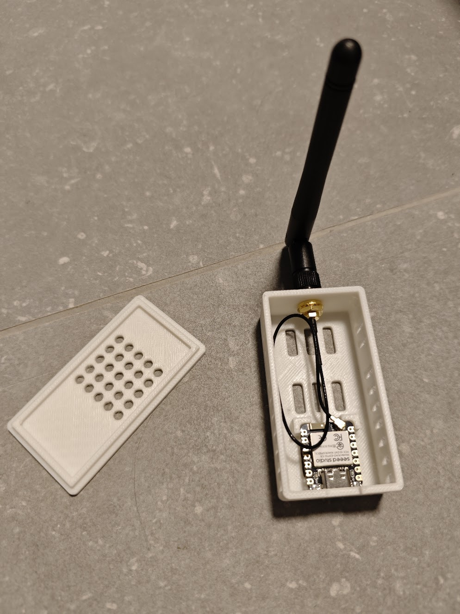

# ESP32-C6 Thread Router Configuration



ESPHome configuration for an ESP32-C6 Thread Router that integrates with Home Assistant. This setup allows you to extend your Thread network coverage using an affordable ESP32-C6 board.

## Required Information

### 1. Thread Network Dataset (TLV)

**The TLV contains ALL network parameters** - you don't need to generate or enter anything manually!

#### Retrieve TLV from existing Thread network:

**Recommended method - via SSH/Terminal:**

1. **SSH** to your Home Assistant (or open Terminal Add-on)
2. **Retrieve TLV data:**
   ```bash
   docker exec otbr ot-ctl dataset active -x-x
   ```
3. **Copy** the hex string (e.g., `0e080000000000010000...`)
4. **Add** to `secrets.yaml`:
   ```yaml
   thread_tlv: "YOUR_TLV_HEX_HERE"
   ```

**That's it!** The TLV contains:
- ✅ Channel
- ✅ Network Name
- ✅ PAN ID & Extended PAN ID
- ✅ Network Key (encrypted)
- ✅ PSKc (encrypted)
- ✅ Mesh-Local Prefix
- ✅ All other parameters

### 2. ESPHome Secrets

In `secrets.yaml` you need:

- **thread_tlv**: Your Thread network commissioning data (see above)

**Note**: API encryption key and OTA password are optional - ESPHome generates them automatically if not specified.

### 3. WiFi

**WiFi is not needed!** This Thread router operates entirely over the Thread network (IPv6):
- ✅ Device communication via Thread mesh
- ✅ OTA updates via Thread/API
- ✅ Logging via Thread/API or USB
- ✅ Home Assistant integration via Thread

No WiFi configuration required - everything works over Thread!

## Installation

### 1. Configure Secrets

Edit `secrets.yaml` with your Thread TLV:
```yaml
thread_tlv: "YOUR_TLV_HEX_HERE"
```

That's all you need - no WiFi credentials required!

### 2. Compile and Flash Firmware

Connect your ESP32-C6 via USB and flash the firmware:

**If using Docker/Podman:**

⚠️ **Important**: When using Docker/Podman (rootless), you need to fix USB permissions before flashing:

```bash
# 1. Check current device permissions
ls -la /dev/ttyACM0
# Should show: crw-rw----. 1 root dialout 166, 0 ...

# 2. Fix permissions (required each time you reconnect USB)
sudo chmod 666 /dev/ttyACM0

# 3. Navigate to Thread directory
cd /home/tristan/Projects/esphome/config/Thread

# 4. Start container
docker-compose up -d

# 5. Flash the firmware
docker-compose exec esphome esphome run /config/Thread/esp32c6-thread-router.yaml --device=/dev/ttyACM0
```

**Important**: The docker-compose.yml mounts the parent `config/` directory to `/config` in the container. That's why you need `/config/Thread/` in the path above. This is necessary so ESPHome can find the build files in `.esphome/`.

**If ESPHome is installed locally:**
```bash
esphome run esp32c6-thread-router.yaml --device=/dev/ttyACM0
```

**Notes**:
- Adjust the device path if needed:
  - Linux: `/dev/ttyUSB0`, `/dev/ttyACM0`, or `/dev/ttyUSB1`
  - macOS: `/dev/cu.usbserial-*` or `/dev/cu.wchusbserial*`
  - Windows: `COM3`, `COM4`, etc.
- Check available ports: `ls /dev/tty*` (Linux/macOS) or Device Manager (Windows)
- **USB permissions for rootless Docker/Podman:**
  
  ⚠️ **On Fedora Atomic/Bazzite with rootless containers**, the `dialout` group method doesn't work reliably. You need to fix permissions with chmod 666:
- The first flash will compile the firmware – this may take 5-10 minutes
- After initial USB flash, subsequent updates can be done wirelessly via OTA

**Alternative: Flash via ESPHome Dashboard:**
```bash
esphome dashboard .
```
Then open browser at `http://localhost:6052` and use the web interface.

## Prerequisites

- ESP32-C6 board - tested with [Seeed Studio XIAO ESP32C6](https://www.seeedstudio.com/Seeed-Studio-XIAO-ESP32C6-p-5884.html)
- Thread Border Router in network (e.g., Home Assistant with Thread integration)
- ESPHome installed
- USB cable for initial flashing
- **Optional**: 3D-printed case - [XIAO ESP32-C6 Thread Router Case](https://www.printables.com/model/1543275-xiao-esp32-c6-zigbee-router-case-split-lid-sma-ext)

## Device Type: FTD vs MTD

- **FTD (Full Thread Device)**: Can act as router and connect other devices (recommended for routers)
- **MTD (Minimal Thread Device)**: End device, cannot route, more power efficient

## Logging Without WiFi

**Good news**: You can log the device over-the-air even with WiFi disabled!

### Logging Options:

**1. Serial Connection (USB)** - Always available:

**2. Over Thread Network (OTA)** - Works without WiFi:
```bash
# Docker/Podman
docker-compose exec esphome esphome logs /config/Thread/esp32c6-thread-router.yaml

# Local ESPHome
esphome logs esp32c6-thread-router.yaml
```
Choose "Over The Air" when prompted. The device uses its Thread IPv6 address to connect.

**3. Via Home Assistant** - Most convenient:
- Go to **Settings → Devices & Services → ESPHome**
- Click on your device (ESP32-C6 Thread Router)
- Click **"Logs"** button
- Real-time logs appear directly in Home Assistant web interface

### How it works:

The current configuration is optimized for Thread-only operation:
- ✅ `api:` enables Home Assistant connection over Thread/IPv6
- ✅ `logger:` is active and works over the API
- ✅ `network.enable_ipv6: true` enables Thread communication
- ✅ WiFi is disabled (no interference, lower power)

Once the ESP32-C6 is connected to Home Assistant via Thread, all logging happens "over the air" through the Thread mesh network - no WiFi needed!

## Verification & Testing

### Check if Thread Router is working:

**1. View Logs:**

When using Docker/Podman:
```bash
cd /home/tristan/Projects/esphome/config/Thread
docker-compose exec esphome esphome logs /config/Thread/esp32c6-thread-router.yaml
```

Choose "Over The Air" option when prompted. You should see:
- IPv6 address like `fd3d:8f96:a13d:1:...` (Thread mesh-local address)
- `[openthread:xxx] Device Type: FTD`
- No continuous error messages

**2. Check Thread Network (on Home Assistant host):**
```bash
# List all Thread devices in network
podman exec otbr ot-ctl router table
# Your ESP32-C6 should appear with Extended MAC and good Link Quality

# Show network state
podman exec otbr ot-ctl state
```

**3. Home Assistant Integration:**
- Go to **Settings → Devices & Services**
- The ESP32-C6 should appear as a discovered device
- Add it to Home Assistant (use `esp32c6-thread-router.local` or IPv6 address)
- Check device status - should show "Online"

**4. Thread Network Status (via SSH):**
```bash
# List all Thread devices in network
podman exec otbr ot-ctl router table

# Show network info
podman exec otbr ot-ctl state
podman exec otbr ot-ctl rloc16
```
Your ESP32-C6 should appear in the router table if it successfully joined as FTD.

**5. Test with Thread Device:**
- Move a Thread device (e.g., Eve, Nanoleaf) closer to the ESP32-C6
- The device should use the ESP32-C6 as its parent router
- Check signal strength improvement

**6. Expected Behavior:**
- ✅ Device boots without errors
- ✅ Joins Thread network automatically
- ✅ Becomes Router (FTD) or Child (depending on network topology)
- ✅ Visible in Home Assistant
- ✅ Responds to API calls over Thread IPv6
- ✅ Can receive OTA updates over Thread

## Troubleshooting

**USB Permission Issues (Docker/Podman rootless):**

On Fedora Atomic/Bazzite or similar systems, the dialout group doesn't work reliably. You need to fix permissions before each flash:

```bash
# Check permissions
ls -la /dev/ttyACM0
# Output: crw-rw----. 1 root dialout 166, 0 ...

# Fix temporarily (resets on USB reconnect)
sudo chmod 666 /dev/ttyACM0
```

**Path Issues:**

The docker-compose.yml mounts `.../config` (parent directory) to `/config` in the container. This is required so ESPHome finds build files.

Inside the container, you have two options:
- Use full path: `/config/Thread/esp32c6-thread-router.yaml`
- OR `cd /config/Thread` first, then use: `esp32c6-thread-router.yaml`

**Device not joining Thread network:**
- Verify TLV in secrets.yaml matches: `podman exec otbr ot-ctl dataset active -x`
- Check Thread Border Router is running: `podman exec otbr ot-ctl state`
- Move ESP32-C6 closer to Border Router
- Restart ESP32-C6 (unplug/replug USB)

## File Structure

```
.
├── esp32c6-thread-router.yaml  # Main ESPHome configuration
├── secrets.yaml                # Sensitive credentials (not in git)
├── .gitignore                  # Excludes secrets and build artifacts
└── README.md                   # This file
```

## Further Resources

- [ESPHome OpenThread Documentation](https://esphome.io/components/openthread/)
- [OpenThread Primer](https://openthread.io/guides/thread-primer/)
- [Home Assistant Thread Integration](https://www.home-assistant.io/integrations/thread/)
