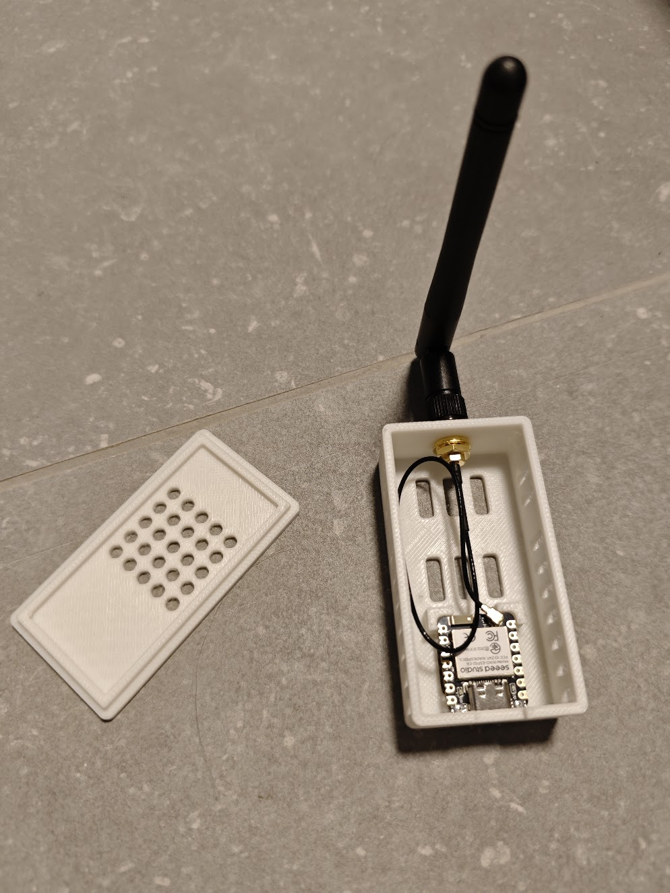

<div align="center">

# 🔗 ESP32-C6 Thread Router

**Extend Your Thread Network Coverage with an Affordable ESP32-C6!**



[](https://esphome.io/)
[](https://www.threadgroup.org/)
[](https://www.home-assistant.io/)

This ESPHome configuration turns an ESP32-C6 board into a Thread FTD (Full Thread Device) router that seamlessly integrates with Home Assistant to expand your Thread mesh network and improve connectivity for your Thread devices.

---

</div>

## ✨ Features

- 📶 **Thread router (FTD)**: extends your Thread mesh, no WiFi needed
- 🔐 **Encrypted API and OTA**: Home Assistant connection and firmware updates use one encryption key
- 📡 **Antenna switch** (Seeed XIAO ESP32C6): choose the built-in or external antenna from Home Assistant
- 📊 **Diagnostics in Home Assistant**: Thread role, RLOC16, channel, IP address, parent RSSI, TX retries, CCA errors, partition changes, uptime
- 💡 **Status LED**: blinks when something is wrong
- 🔁 **Restart button** in Home Assistant

## 📋 Prerequisites

| Requirement | Description |
|-------------|-------------|
| **🔧 Hardware** | ESP32-C6 board (tested with [Seeed Studio XIAO ESP32C6](https://www.seeedstudio.com/Seeed-Studio-XIAO-ESP32C6-p-5884.html)) |
| **🌐 Network** | Thread Border Router in network (e.g., Home Assistant with Thread integration) |
| **💻 Software** | ESPHome **2026.8 or newer** (required for the Thread diagnostic sensors) |
| **🔌 Cable** | USB cable for initial flashing |
| **📦 Optional** | 3D-printed case - [XIAO ESP32-C6 Case](https://www.printables.com/model/1543275-xiao-esp32-c6-zigbee-router-case-split-lid-sma-ext) |

> **💡 Other boards:** The config also works on other ESP32-C6 boards. Remove the block marked `Seeed XIAO ESP32C6 specific` in `esp32c6-thread-router.yaml`, since it drives GPIO3, GPIO14 and GPIO15. ESPHome also supports Thread on ESP32-C5, ESP32-H2 and (since 2026.7) nRF52 boards, but this config is only tested on the ESP32-C6.

## 🔑 Required Information

### 🌐 1. Thread Network Dataset (TLV)

> **💡 Important:** The TLV contains ALL network parameters - you don't need to generate or enter anything manually!

#### 📥 Retrieve TLV from existing Thread network:

**✅ Recommended method - via SSH/Terminal:**

**Step 1:** SSH to your Server

**Step 2:** Retrieve TLV data (use `podman` instead of `docker` if you run Podman):
```bash
docker exec otbr ot-ctl dataset active -x
```

**Step 3:** Copy the hex string (e.g., `0e080000000000010000...`)

**Step 4:** Add to `secrets.yaml`:
```yaml
thread_tlv: "YOUR_TLV_HEX_HERE"
```

**🎉 That's it!** The TLV contains:

<table>
<tr><td>✅ Channel</td><td>✅ Network Name</td><td>✅ PAN ID & Extended PAN ID</td></tr>
<tr><td>✅ Network Key</td><td>✅ PSKc</td><td>✅ Mesh-Local Prefix</td></tr>
</table>

> ⚠️ **Keep the TLV secret!** The network key is stored in the TLV **in plain text**. Anyone with your TLV can join your Thread network. Never commit `secrets.yaml` or post the TLV anywhere. The firmware image also contains the TLV, so don't share compiled `.bin` files.

### 🔐 2. API Encryption Key

The Home Assistant API and OTA updates are encrypted with a shared key. Generate one:

```bash
openssl rand -base64 32
```

Or copy a freshly generated key from the [ESPHome API docs](https://esphome.io/components/api/).

### 📄 3. ESPHome Secrets

In `secrets.yaml` you need:

| Key | Description | Required |
|-----|-------------|----------|
| **thread_tlv** | Your Thread network dataset (hex) | ✅ Required |
| **api_encryption_key** | 32-byte base64 key for API and OTA encryption | ✅ Required |

## 🚀 Installation

### 📝 Step 1: Configure Secrets

Create `secrets.yaml` next to `esp32c6-thread-router.yaml`:
```yaml
thread_tlv: "YOUR_TLV_HEX_HERE"
api_encryption_key: "YOUR_BASE64_KEY_HERE"
```

That's all you need - no WiFi credentials required!

### 📡 Step 2: Choose the Antenna (Seeed XIAO ESP32C6 only)

The XIAO ESP32C6 has a built-in ceramic antenna and a U.FL connector for an external antenna (e.g. the SMA antenna of the recommended case). The antenna is selected by an RF switch (GPIO3 = switch power, GPIO14 = antenna select).

If you use an **external antenna**, change this substitution before flashing:
```yaml
substitutions:
  antenna_default: RESTORE_DEFAULT_ON   # external antenna
```

You can also toggle the **External Antenna** switch in Home Assistant later. The setting is kept across reboots.

> ⚠️ Without an external antenna connected, keep the built-in antenna selected. Otherwise the range will be very poor.

### ⚡ Step 3: Compile and Flash Firmware

Connect your ESP32-C6 via USB and flash the firmware using local ESPHome:

```bash
esphome run esp32c6-thread-router.yaml --device=/dev/ttyACM0
```

> **💡 Note:** Replace `/dev/ttyACM0` with your device path (see troubleshooting below)

<details>
<summary><b>📚 Important Notes & Troubleshooting</b></summary>

### 📍 Device Paths by OS

| OS | Typical Paths |
|----|--------------|
| 🐧 Linux | `/dev/ttyUSB0`, `/dev/ttyACM0`, `/dev/ttyUSB1` |
| 🍎 macOS | `/dev/cu.usbserial-*`, `/dev/cu.usbmodem*` |
| 🪟 Windows | `COM3`, `COM4`, etc. |

**Check available ports:**
- Linux/macOS: `ls /dev/tty*`
- Windows: Device Manager

### 🔐 USB Permission Issues

**Standard Linux - Add user to dialout group:**
```bash
sudo usermod -a -G dialout $USER
# Then log out and back in
```

**Fedora Atomic/Bazzite with rootless Docker/Podman:**

The dialout group doesn't work reliably on immutable systems. You need to fix permissions before each flash:

```bash
# Check permissions
ls -la /dev/ttyACM0
# Output: crw-rw----. 1 root dialout 166, 0 ...

# Fix temporarily (resets on USB reconnect)
sudo chmod 666 /dev/ttyACM0

# If using Docker/Podman, restart the container
docker compose restart
```

> ⚠️ **Note:** You need to run `sudo chmod 666` each time you reconnect the USB device.

</details>

---

<details>
<summary><b>🐳 Alternative: Using Docker/Podman</b></summary>

The included `docker-compose.yml` mounts this repository as `/config` and passes the USB device into the container.

> ⚠️ **Important:** The USB device must be plugged in **before** the container starts. When using Docker/Podman (rootless), fix USB permissions first (see above).

```bash
# 1. Start container (default device: /dev/ttyACM0)
docker compose up -d
# or with another device:
ESPHOME_DEVICE=/dev/ttyUSB0 docker compose up -d

# 2. Flash the firmware
docker compose exec esphome esphome run /config/esp32c6-thread-router.yaml --device=/dev/ttyACM0
```

</details>

---

<details>
<summary><b>🌐 Alternative: Web Dashboard (GUI)</b></summary>

**Docker Dashboard:**
```bash
docker compose up -d
```
The ESPHome container starts the dashboard automatically. Open **http://localhost:6052** in your browser.

> ⚠️ The dashboard has no password and listens on all interfaces (host networking). Only run it on a trusted network, or stop the container after flashing.

**Local Dashboard** (requires local ESPHome):
```bash
esphome dashboard .
```
Then open **http://localhost:6052** in your browser and use the web interface.

**Browser Flashing via [web.esphome.io](https://web.esphome.io/):**

web.esphome.io can only **flash** a finished firmware file. It cannot compile your YAML. Because the TLV is compiled into the firmware, you have to build it yourself first:

1. Compile locally: `esphome compile esp32c6-thread-router.yaml`
2. The firmware is written to `.esphome/build/esp32c6-thread-router/.pioenvs/esp32c6-thread-router/firmware.factory.bin`
3. Open **https://web.esphome.io/** in Chrome or Edge, click "Connect", choose your ESP32-C6 and select "Install"
4. Upload the `firmware.factory.bin` file

</details>

## ✅ Verification & Testing

### 🔍 Check if Thread Router is working:

#### 📋 Method 1: View Logs

> **🎉 Good news:** You can view logs over-the-air even with WiFi disabled!

**Logging Options:**

**🔌 Option A: Serial Connection (USB)**
- Always available - Connect via USB cable

**📡 Option B: Over Thread Network (OTA)**
- Works without WiFi! The device uses its Thread IPv6 address to connect.

```bash
esphome logs esp32c6-thread-router.yaml
```

Choose "Over The Air" option when prompted. You should see:
- IPv6 address like `fd3d:8f96:a13d:1:...` (Thread mesh-local address)
- `[openthread:xxx] Device Type: FTD`
- No continuous error messages

---

#### 🌐 Method 2: Check Thread Network
```bash
# List all Thread routers in the network
docker exec otbr ot-ctl router table
# Your ESP32-C6 should appear with Extended MAC and good Link Quality

# Show network state
docker exec otbr ot-ctl state
```

> **💡 Note:** A new FTD first joins as a child (*REED*, Router Eligible End Device). Thread only promotes it to *router* when the mesh needs another router, which can take a few minutes, or not happen at all in a small network. It only shows up in the router table after that. You can see the current role in the **Thread Role** sensor in Home Assistant.

---

#### 🏠 Method 3: Home Assistant Integration
- Go to **Settings → Devices & Services**
- The ESP32-C6 should appear as a discovered device
- Add it to Home Assistant (use `esp32c6-thread-router.local` or IPv6 address)
- Enter the `api_encryption_key` from your `secrets.yaml` when asked
- Check device status - should show "Online"

## 📊 Diagnostics in Home Assistant

The device exposes these diagnostic entities:

| Entity | Meaning |
|--------|---------|
| **Thread Role** | `router`, `child`, `leader`, `detached` or `disabled` |
| **Thread RLOC16** | Short address in the mesh. Routers end in `00` (e.g. `0x3400`) |
| **Thread Channel** / **Thread IP Address** | Current channel and IPv6 address |
| **Thread Parent RSSI** | Signal strength to the parent. Only meaningful while the device is a child, not as router |
| **Thread TX Retries** / **Thread TX CCA Errors** | Rising fast = poor link or busy channel (e.g. WiFi on the same frequencies) |
| **Thread Partition Changes** | Rising = the mesh keeps splitting, check placement/range |
| **Uptime** | Detects unexpected reboots |
| **External Antenna** (XIAO only) | Switch between built-in and external antenna |
| **Restart** | Restart the device |

More sensors (link quality, RX/TX totals, attach attempts, ...) are available in the [openthread_info](https://esphome.io/components/text_sensor/openthread_info/) component and can be added to the `sensor:` section.

## ⚙️ Advanced Options

### 📶 Transmit Power

Since ESPHome 2026.3 the transmit power can be set. The ESP32-C6 supports -15 to 20 dBm:

```yaml
openthread:
  output_power: 10dBm
```

> ⚠️ Respect the regulatory limits for 2.4 GHz in your country. More power only helps if the other devices can also reach the router, since Thread links are bidirectional.

### 🔄 Thread Network Was Recreated / TLV Changed

The router stores the Thread dataset in flash after the first start and then **ignores** the `tlv` from the config. If you recreate your Thread network or change the TLV, the router stays in the old network.

To apply a new TLV:

1. Update `thread_tlv` in `secrets.yaml`
2. Uncomment `force_dataset: true` in the `openthread:` section and flash
3. Once the router has joined, comment it out again and flash once more

> **💡 Why not keep `force_dataset: true` permanently?** The Thread network can change its dataset at runtime, e.g. when Home Assistant moves it to another channel. With `force_dataset: true` the router would fall back to the old dataset from the config after every reboot.

## 🔀 Multiple Thread Routers

To flash multiple ESP32-C6 devices and use them as separate routers in the same Thread network, create a small file per additional device (e.g. `esp32c6-thread-router-2.yaml`) that reuses the main config:

```yaml
substitutions:
  name: esp32c6-thread-router-2            # Must be unique!
  friendly_name: ESP32-C6 Thread Router 2
  # antenna_default: RESTORE_DEFAULT_ON    # Optional: external antenna

packages:
  base: !include esp32c6-thread-router.yaml
```

Then flash it:
```bash
esphome run esp32c6-thread-router-2.yaml --device=/dev/ttyACM0
```

All devices share the same `secrets.yaml` (same TLV = same Thread network). Changes to the main config apply to all devices on the next flash. Each device will join the same Thread network and act as an independent router, extending your mesh coverage.

## 📂 File Structure

```
.
├── esp32c6-thread-router.yaml    # Main ESPHome configuration
├── esp32c6-thread-router-2.yaml  # Optional: second router (includes the main config)
├── secrets.yaml                  # Shared secrets (not in git)
├── docker-compose.yml            # Optional: ESPHome in Docker/Podman
├── .github/workflows/            # CI: validates and compiles the config
├── .gitignore                    # Excludes secrets and build artifacts
└── README.md                     # This file
```

## 📚 Further Resources

| Resource | Description |
|----------|-------------|
| 📖 [ESPHome OpenThread Documentation](https://esphome.io/components/openthread/) | Official ESPHome Thread component docs |
| 📊 [ESPHome OpenThread Info](https://esphome.io/components/text_sensor/openthread_info/) | Thread diagnostic sensors |
| 📡 [Seeed XIAO ESP32C6 Wiki](https://wiki.seeedstudio.com/xiao_esp32c6_getting_started/) | Pinout and RF switch of the XIAO ESP32C6 |
| 🔗 [OpenThread Primer](https://openthread.io/guides/thread-primer/) | Learn the basics of Thread networking |
| 🏠 [Home Assistant Thread Integration](https://www.home-assistant.io/integrations/thread/) | How Thread works in Home Assistant |

---

<div align="center">

⭐ Like the ESP32-C6 Thread Router? A [star on GitHub](https://github.com/firsttris/esp32c6-thread-router) helps others find it.<br>
🐛 [Report a bug](https://github.com/firsttris/esp32c6-thread-router/issues/new) · 💡 [Request a feature](https://github.com/firsttris/esp32c6-thread-router/issues/new)

<sub>License: <a href="LICENSE">MIT</a> · © Tristan Teufel and contributors</sub>

</div>
